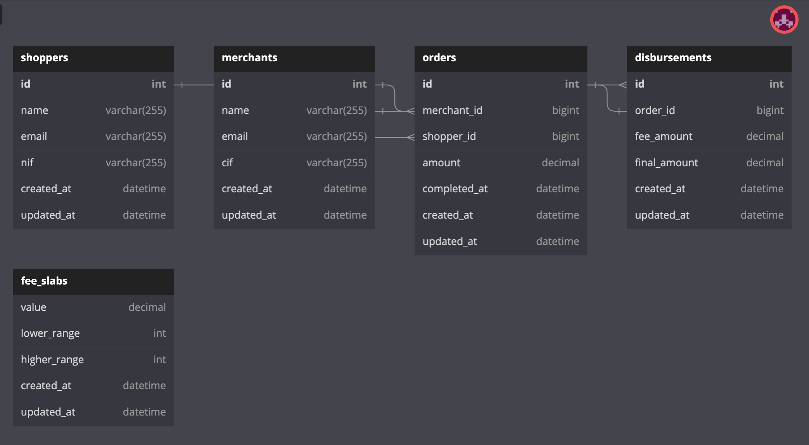

# The challenge

Company provides e-commerce shops (merchants) a flexible payment method so their customers (shoppers) can purchase and receive goods without paying upfront. Company earns a small fee per purchase and pays out (disburse) the merchant once the order is marked as completed.

The operations manager is now asking you to make a system to calculate how much money should be disbursed to each merchant based on the following rules:

- Disbursements are done weekly on Monday.
- We disburse only orders which status is completed.
- The disbursed amount has the following fee per order:
    - 1% fee for amounts smaller than 50 €
    - 0.95% for amounts between 50€ - 300€
    - 0.85% for amounts over 300€

We expect you to:

- Create the necessary data structures and a way to persist them for the provided data. You don't have to follow our schema if you think another one suits better.
- Calculate and persist the disbursements per merchant on a given week. As the calculations can take some time it should be isolated and be able to run independently of a regular web request, for instance by running a background job.
- Create an API endpoint to expose the disbursements for a given merchant on a given week. If no merchant is provided return for all of them.

### MERCHANTS

```
ID | NAME                      | EMAIL                             | CIF
1  | Treutel, Schumm and Fadel | info@treutel-schumm-and-fadel.com | B611111111
2  | Windler and Sons          | info@windler-and-sons.com         | B611111112
3  | Mraz and Sons             | info@mraz-and-sons.com            | B611111113
4  | Cummerata LLC             | info@cummerata-llc.com            | B611111114

```

### SHOPPERS

```
ID | NAME                 | EMAIL                              | NIF
1  | Olive Thompson       | olive.thompson@not_gmail.com       | 411111111Z
2  | Virgen Anderson      | virgen.anderson@not_gmail.com      | 411111112Z
3  | Reagan Auer          | reagan.auer@not_gmail.com          | 411111113Z
4  | Shanelle Satterfield | shanelle.satterfield@not_gmail.com | 411111114Z

```

### ORDERS

```
ID | MERCHANT ID | SHOPPER ID | AMOUNT | CREATED AT           | COMPLETED AT
1  | 25          | 3351       | 61.74  | 01/01/2017 00:00:00  | 01/07/2017 14:24:01
2  | 13          | 2090       | 293.08 | 01/01/2017 12:00:00  | nil
3  | 18          | 2980       | 373.33 | 01/01/2017 16:00:00  | nil
4  | 10          | 3545       | 60.48  | 01/01/2017 18:00:00  | 01/08/2017 15:51:26
5  | 8           | 1683       | 213.97 | 01/01/2017 19:12:00  | 01/08/2017 14:12:43

```

## Database Design:

[https://dbdiagram.io/d/63cba2eb296d97641d7b26ac](https://dbdiagram.io/d/63cba2eb296d97641d7b26ac) (Full context)



### Relationship call outs

1. The shopper has many orders, and the order belongs to the shopper.
2. The merchant has many orders, and the order belongs to the merchant.
3. For every order, we will have to process a disbursement.
    1. Criteria to consider while creating the new table structure for disbursement:
        1. Once the order is fulfilled, the **`completed_at`** field will have a value; otherwise, it will be **`nil`**.
        2. Disbursement and order can have a 1:1 relationship.
4. The shopper has many merchants through orders.
5. The merchant has many shoppers through orders.
6. **Fee Slab**:
    1. The Fee Slab is an exclusive table structure in the DB and the value persisted.
    2. Since fee percentages work on a range, having a structure of lower and higher range and value makes it very easy to query the value. Also, maintaining this in the DB gives us the flexibility to add new fee ranges/slabs easily.
    3. Another option is to look at interval binary trees (**[https://www.geeksforgeeks.org/interval-tree/](https://www.geeksforgeeks.org/interval-tree/)**).
    4. Since there is always a requirement of maintaining a higher range and a lower range, so the constraint is that
        1. order amount > **`0`** euro
        2. order amount < **`100000000`** euro


## Business Logic

1. A lot of heavy lifting is done by the service `Disbursements::CreateService.perfo`
    1. The approach I have taken is the Railway Oriented Programming paradigm, and dry-rb's monads give nice methods to achieve it, more information on -

       **[https://dry-rb.org/gems/dry-monads/1.3/](https://dry-rb.org/gems/dry-monads/1.3/)**

    2.  It makes the code much more readable, especially when every step in the service objects returns the `Result`
    3. It makes it a lot easier to write tests.
2. This service has the flexibility to perform disbursement at different ranges by passing the start date time, and end date time.
3. The `process_disbursement` method is transactional. If a record fails to charge disbursement, the entire date range is rolled back, this way ops team can perform a manual intervention to have that processed (This can be changed based on further discussion).
4. To fetch all the disbursements.
    1. it is mandatory to pass the `start_date_of_week`
    2. The `merchant_id` is optional
    ```bash
	  {{host}}/api/disbursements?start_date_of_week="2023-01-23"&merchant_id=5
    ```

## Improvements:

- Build an authentication and rate limiter layer for the APIs.
- Ensure that if a job is running, the system prevents the same job from running again at the same time and that two workers are not picking up the same task.
    - We can use something like a Redis mutex lock here **[https://redis.io/docs/manual/patterns/distributed-locks/](https://redis.io/docs/manual/patterns/distributed-locks/)**
- Improve error handling of the APIs, in case of 500 errors.
- Extract complex queries in the disbursement controller to query objects, so they can be tested in isolation.
- Extract filter validation to a concern.
- Plug in coverage tools such as Simplecov.


## How to set up a dev machine?

- Ruby version & Rails Version

    ```bash
    ruby 2.7.0p0 & Rails 6.0.6.1
    ```

- System dependencies (If you’re on run MacOS, use brew package manager)

    ```bash
    brew install postgres
    brew install redis
    ```

- Database creation, migrations, and seeding

    ```bash
    rails db:create db:migrate db:seed
    ```

- How to run the test suite

    ```bash
    rails test
    ```

- Loading test data using rake task

    ```bash
    rake load_test_data
    ```